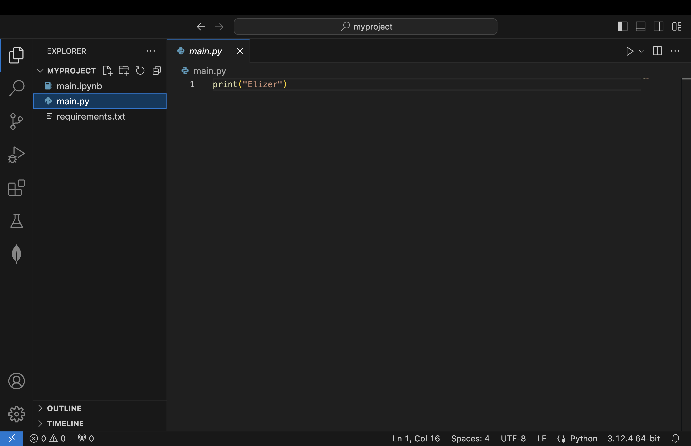
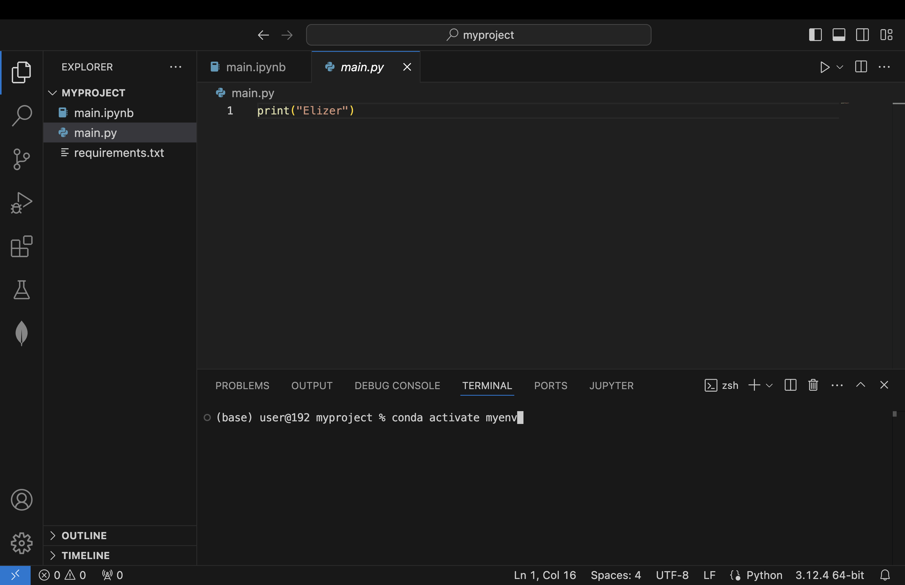
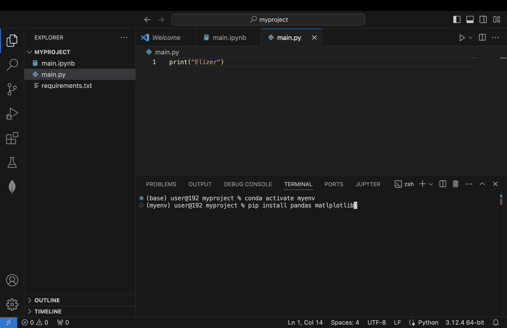
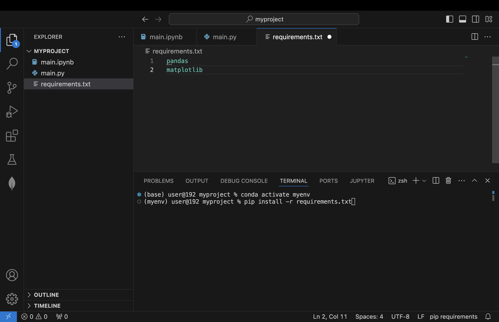

# An Introduction to VSCode + Python + Conda for Machine Learning

 Python is the most popular programming language used for machine learning. Let’s see how to setup a python environment for ML using VSCode and Conda.

  ## Installing Python
Typically, installing python in your computer simply involves going to Python.org, going to the downloads section and selecting the latest version of python that shows there and install it like you do for any other software.

**Machine Learning Engineers generally don’t install Python this way.**

Machine Learning projects normally have dependencies that are constantly updated. When working on multiple projects, various projects can use different versions of dependencies. There are chances that you code might break if you update / use different versions of packages from what you started.

## What are Python Dependencies?

In Python, dependencies refer to external libraries, modules, or packages that a Python script or application requires to function properly. These dependencies provide additional functionality, tools, or data that the main program relies on.

Dependencies in Python can include standard library modules that are part of the Python installation, as well as third-party packages that need to be installed separately. Third-party packages are typically installed using a package manager like pip, the default package installer for Python.

When a Python program has dependencies, it means that in order to run the program, those dependencies must be available and installed on the system. If a required dependency is missing or has an incompatible version, the program may not execute correctly or may encounter errors.

Managing dependencies is an important aspect of Python development, as it ensures that a program can be reliably deployed and run on different environments or systems. Developers often document the required dependencies in a file, such as a **requirements.txt** file, to make it easier to install all the necessary packages when setting up a new development environment or deploying the application.

So, it’s a good practice to use a package manager like Conda.

So how does it work?

## Conda for Managing Dependencies
Conda is a utility that facilitates the management of Python and its supplementary tools, known as packages.

It can be likened to a filing cabinet that stores all necessary resources for a project. Conda ensures proper organization, preventing the accidental mixing of files or utilization of incorrect tools

You have two options, you can either use the full version called **Anaconda** or its light version called **miniconda**

**Anaconda** is a full featured installer that comes with a GUI application for working with conda environments.

**Miniconda** is the minimal version if you want to install python packagers without a GUI. Installing packages is mostly done via terminal/command prompt

For this tutorial, we will use miniconda. You can download miniconda here: https://docs.anaconda.com/miniconda/

## Creating a Conda Environment

Conda allows you to create separate environments, each containing their own files, packages, and package dependencies. The contents of each environment do not interact with each other.

Upon installing conda, go to command prompt for (Windows) or terminal (macOS) and enter 

``conda`` 

to verify if conda is successfully installed

The next step is to create a new environment. To do this, we use  the following command:

``conda create --name <env-name>``

Where ``<env-name>`` is the name of your conda environment

Normally, creating the environment and installing the specific python version is done using a single line

``conda create --name myenv python==3.10``

You can have multiple environments defined one for each project you may be working on.

So, whenever you want to work in that project, you activate that specific project’s environment and start working.

Once you activate and enter a particular environment, the specific version of Python and packages will be used and any package you install will be installed in that specific environment only and will not affect other projects.

## Activate the Conda Environment

 When working with machine learning projects in python in VSCode, create a folder containing a python file or open the folder if the project is already existing.

In python, there are two types of python files. 

The first one is standard python file with a file extension of .py

The second one is a notebook file with a file extension name of .ipynb

### For .py files

To activate a conda environment using a standard python file, Go to the terminal and enter the command

``conda activate myenv``

### For .ipynb files

To activate a conda environment for .ipynb files, Click "Select Kernel"

Next, choose "Python Environments"

Then, choose "myenv"

## Installing Python Dependencies

The next step is to install the dependencies for your project. 

To install dependencies, we will use pip.

For this tutorial, we will install pandas and matplotlib. Open the terminal and enter the command

``pip install pandas matplotlib``

This should install both dependencies in your environment.

Most machine learning projects have more than 10 to 20 dependencies. To deal with this, it is much easier to put the name of all dependencies in a **requirements.txt** file and using pip again to install all the dependencies in the file.

Enter the command

`` pip install -r requirements.txt``

To install all dependencies specified in the file.

Finally, run the python files to verify if all is working properly

